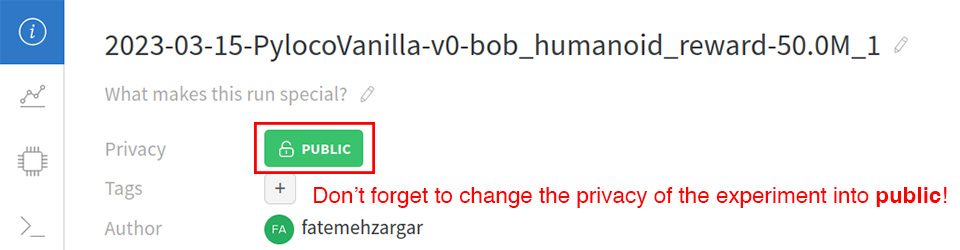

# Assignment2 - Hello Reinforcement Learning!

**Hand-in:** 30 March 2023, 14:00 CEST

----

Leave your name, student ID, ETH email address and URL link to demo video here.

- Name:
- Student ID:
- ETH Email:
- W&B URL (Ex.1):
- W&B URL (Ex.2-1):
- W&B URL (Ex.2-2):
- W&B URL (Ex.2-3):
- W&B URL (Ex.3):
- W&B URL (Bonus):

----

Last time, we built a character animation pipeline based on simple rule-based planning strategies and inverse
kinematics.
Today, we are going to take a sneak peak at the more modern and automated character animation technique, namely
**physically-based character animation via reinforcement learning**.

Reinforcement learning (RL) is a machine learning approach that trains a policy that maximizes a user-specified reward
function.
By numerous trial-and-errors, it automatically finds an optimal policy without any prerecorded dataset or human-designed
strategy.
A cool thing about RL in character animation (or robotics) context is that it can generate physically realistic motions
without motion capture data or any preprogrammed ruled-based strategies.

Understanding how RL works is very important, but it is out-of-scope of this assignment. Rather, we are going to gain a
bit of hands-on experience by training walking controllers for a quadrupedal and a bipedal (humanoid) characters.

*Figure 1: in this assignment we train control policies for quadrupedal (left) and humanoid (right) characters by using RL.*

## Hand-in and Evaluation

Once you complete this assignment you should hand in

- code pushed to your github repository.
- weights and biases URL of RL experiments.

The grading scheme is as follows

- baseline (100%): 
  - (20%) Ex 1: Correct reward implementation. 
  - (20%) Ex 2: Correct reward implementation.
  - (20%) Ex 3: Correct reward implementation. 
  - (8%)  Ex 1: Fully run experiment. (W&B URL) 
  - (8%)  Ex 2.1: Fully run experiment. (W&B URL)
  - (8%)  Ex 2.2: Fully run experiment. (W&B URL)
  - (8%)  Ex 2.3: Fully run experiment. (W&B URL) 
  - (8%)  Ex 3: Fully run experiment. (W&B URL)
- bonus (30%, optional): bonus exercise

**IMPORTANT:** If your code is not built successfully, you will get **zero** point from this assignment. So make sure
your code is built without any build/compile error.

**IMPORTANT:** If the system detect a suspected plagiarism case, you will get **zero** point from this assignment.

**IMPORTANT:** Make sure your W&B training sessions are in public mode so that we can see your run. You can specify this
for each run. See the image below:

*Figure 2: when you share your RL experiment logs, please make sure you change the privacy into public.*

Please leave your questions on GitHub issue, so your colleagues also can join our discussions.

## Before we start...

RL is an automated process, but it also requires a complex set of software infrastructures:

- a simulation tool for data generation
- an implementation of RL algorithms for training
- a monitoring tool

But don't worry (Lucky you!) We have built a nice code base and workflow for you. Before you start working on the
assignment,
please follow the provided instruction [HOWTO](HOWTO.md) to set up the workflow.

## Exercises

Let's start from formulating a RL problem. Our policy $\mathbf{\pi}$ maps observations $\mathbf{o}$ to actions $\mathbf{a}$ i.e. $\mathbf{\pi}(\mathbf{o}) = \mathbf{a}$. Here, **actions of our policy is joint angle targets** we send to our characters. This target is sent to PD controller (which is already implemented in our simulator) of the characters and converted into torque command (TMI: technically this is much complicated than that, but for now, you can just consider we have PD controller which converts joint angle targets into joint torque.)

The quadrupedal character has 12 joints, and humanoid character has 43 joints, and we normalize the joint angle target into the range of $[-1, +1]$
 where -1 is map to minimum joint angle and +1 is map to maximum joint angle.

The way we define the observations is slightly more complicated, but you can consider the observation of the RL agent is defined as a concatenated vector of generalized coordinates and generalized velocity of the characters excepting (x, z) coordinates of the base position and the yaw angle of base orientation. (Quick Quiz: can you guess why we except (x, z) and yaw angle of base orientation from the observation? Please feel free to leave your idea on [issue](https://github.com/Digital-Humans-23/a2/issues/1) and discuss with your colleagues.)

Then now, it's time to define a reward function. Let's start with it!

### Ex.1 Quadratic Dog

In this exercise, we are going to train a RL policy for a dog robot.
We want to let the robot dog walk following the velocity command you give.
Thus, we have to give the policy some **incentive** to follow the command.
We can do this through designing the following reward function:

$$1 - \frac{| v_{local,fwd} - v_{cmd} |}{v_{cmd}}$$

Simple. Right? However, in practice, this reward term alone cannot really induce a nice walking motion.
Typically, a policy trained with this reward function generates a motion like this...

*Figure 3: oops... the velocity tracking alone is not enough to induce natural walking motions.*

Well, it makes sense. The robot follows the velocity command perfectly, but of course, this is not what we really want.
Then how can we induce nice walking motions?

Well, it is known that optimizing a policy over joint torque can induce a natural walking motions. So we are going to
add
another reward term to our reward function which penalizes 2-norm of joint torque vectors $\mathbf{\tau}$:

$$-\Vert \mathbf{\tau} \Vert_2^2$$

Also, a bit of regularization over time derivatives of joint action helps to generate smooth motions:

$$-\Vert \dot{\mathbf{a}} \Vert_2^2$$

$$-\Vert \ddot{\mathbf{a}} \Vert_2^2$$

In summary, we are going to use all these reward terms aforementioned together and sum them up with some weights

$$R = w_v (1 - \frac{| v_{local,fwd} - v_{cmd} |}{v_{cmd}}) - w_t \Vert \mathbf{\tau} \Vert_2 - w_a(w_{a1} \Vert
\dot{\mathbf{a}} \Vert_2 + w_{a2} \Vert \ddot{\mathbf{a}} \Vert_2)$$

Okay, so your task is to implement different terms of this reward function. Then run the training and see how it
behaves. Please see the detailed description below.

**Code:**

- Files:
  - `src/python/pylocogym/envs/rewards/dog/quadratic_reward.py`
- Functions:
  - `compute_reward( ... )`

**Additional files:**

- Config:
  - `data/conf/dog_quadratic_env.json`
- Job file:
  - `jobs/01_quadratic_reward`

**Task:**

- Implement a quadratic reward to make the dog move at a commanded speed. Push to autograde.
- After successfully passing the tests, compile your code on the server and run the training job. Send the URL of the
  corresponding training session in weights and biases. (Approx. training time: **7.5 hours**)

**Details:**

- Forward velocity reward `forward_vel_reward`: $w_v(1 - | v_{local,fwd} - v_{cmd} | / v_{cmd})$
- Torque `torque_reward`: $-w_{\tau}\Vert \mathbf{\tau} \Vert_2^2$
- 1st order smoothness `smoothness1_reward`: $-w_{a1}\Vert \dot{\mathbf{a}} \Vert_2^2$
- 2nd order smoothness `smoothness2_reward`: $-w_{a2}\Vert \ddot{\mathbf{a}} \Vert_2^2$

After a successful RL training, the behavior of your policy will look like this:

### Ex.2 Gaussian Dog

Even with the simple weighted sum of quadratic reward terms, you can train a pretty nice policy.
However, tuning weights of the quadratic reward terms is not trivial, especially when you have many reward terms.

So oftentimes, people use **Gaussian rewards** which provides intuitive way to tune. The Gaussian reward term looks like
this:

$$\text{exp}(- \frac{e^2}{2 \sigma^2})$$

Here, $e$ is the variable you want to minimize, and the parameter $\sigma$ is the control variable you can tune.
The rule of the thumb to choose the suitable value for $\sigma$ is the following: in the ideal case, the value of $e$ of
roughly 68% of the all trial would be fall within the range of $[-\sigma, \sigma]$ (think about Gaussian distribution!)

We note that the choice of the initial distribution of policy actions can sometimes play an important rule in how fast/slow you
can get the desired behaviour. In this exercise you are asked to try different standard deviations for the initial
distribution to see how it affects the training. Think about the difference. How could you encourage/discourage
exploration?

**Code:**

- Files:
  - `src/python/pylocogym/envs/rewards/dog/gaussian_reward.py`
- Functions:
  - `compute_reward( ... )`

**Additional files:**

- Config:
  - `data/conf/dog_gaussian_env.json`
- Job file:
  - `jobs/02_gaussian_reward`

**Task:**

- Implement a Gaussian reward to make the dog move at a commanded speed. Push to autograde.
- (2.1) After successfully passing the tests, compile your code on the server and run the training job. Send the URL of the
  corresponding training session in weights and biases. (Approx. training time: **7.5 hours**)
- (2.2) Now change the `log_std_init` in the config to -1.0 and run a new train. Send the W&B URL of the trainings. (Approx.
  training time: **7.5 hours**)
- (2.3) Now change the `log_std_init` in the config to 0.0 and run a new train. Send the W&B URL of the trainings. (Approx.
  training time: **7.5 hours**)

**Details:**
The total reward is composed of:

- Forward velocity reward `forward_vel_reward`: $w_v \text{exp}(- |v_{local,fwd} - v_{cmd}|^2 / (2 \sigma_v^2))$
- Torque `torque_reward`: $\text{exp}(- w_{\tau}\Vert \mathbf{\tau} \Vert_2^2 / (2 N \sigma_t^2))$
- 1st order smoothness `smoothness1_reward`: $w_{a1}\text{exp}(- \Vert \dot{\mathbf{a}} \Vert_2^2 / (2 N \sigma_{a1}^2))$
- 2nd order smoothness `smoothness2_reward`: $w_{a2}\text{exp}(- \Vert \ddot{\mathbf{a}} \Vert_2^2 / (2 N \sigma_{a2}^2))$

**Note:** $N$ corresponds to the total number of joints.

### Ex.3 Prevent Bob from falling

So far you saw how to make a dog walk using RL. What about digital humans? That is usually a much harder problem.
Quadrupeds can stand with no training required. But, that is not the case for bipeds. They need a controller to keep
their balance. In this exercise you will implement a reward to prevent a biped from falling down.

**Code:**

- Files:
  - `src/python/pylocogym/envs/rewards/bod/humanoid_reward.py`
- Functions:
  - `compute_reward( ... )`

**Additional files:**

- Config:
  - `data/conf/bob_env.json`
- Job file:
  - `jobs/03_bob`

**Task:**

- Implement a Gaussian reward to prevent Bob from falling over. Push to autograde.
- After successfully passing the tests, compile your code on the server and run the training job. Send the URL of the
  corresponding training session in weights and biases. (Approx. training time: **16 hours**)

**Details:**

The total reward is composed of:

- Forward velocity reward `forward_vel_reward`: $w_v \text{exp}(- |v_{local,fwd} - v_{cmd}|^2 / (2 \sigma_v^2))$
- base height `height_reward`: $w_h \text{exp}(- |y-y_{nominal}|^2 / (2 \sigma_h^2))$
- Attitude `attitude_reward`: $w_{rp} \text{exp}(- (|roll|^2 + |pitch|^2) / (4 \sigma_{rp}^2))$
- Torque `torque_reward`:  $\text{exp}(- w_{\tau}\Vert \mathbf{\tau} \Vert_2^2 / (2 N \sigma_t^2))$
- 1st order smoothness `smoothness1_reward`: $w_{a1}\text{exp}(- \Vert \dot{\mathbf{a}} \Vert_2^2 / (2 N \sigma_{a1}^2))$
- 2nd order smoothness `smoothness2_reward`: $w_{a2}\text{exp}(- \Vert \ddot{\mathbf{a}} \Vert_2^2 / (2 N \sigma_{a2}^2))$
- Joint angle `joint_reward`: $w_{j}\text{exp}(- \Vert \theta-\theta_{default} \Vert_2^2 / (2N\sigma_j^2))$

After a successful RL training, the behavior of your policy will look like this:

## Bonus
In exercise 1 to 3 we used simple parameters in the config files (`data/conf/*.json`) to train our characters. If you adjust learning rates, the size of the networks, batch size, etc.. you can potentially get better convergence rates or even better rewards.

Tune any of the exercises (Quadratic Dog, Gaussian Dog, or Bob) and for each exercise where you manage to get better convergence or better rewards you can get 5 extra points. Remember to add the W&B links of your fine-tuned experiments.

## Final Note

Congratulation! Now you know how to train a RL policy for your robots.
So how do you like it? Can you say RL is really an "automated" process? Is it easy to guide the policy to perform in
the way you want?
Well, you might already notice that it still requires a lot of reward shaping, manual tunings to induce a behavior you
want to get.

In practice, a lot of character animation techniques leverage prior knowledge or prerecorded motion capture data to get
more natural character motions.

If you are interested in, I refer you to some research papers most related to this topic:

- Peng et al., DeepMimic: example-guided deep reinforcement learning of physics-based character skills, 2018.
- Peng et al., AMP: Adversarial Motion Priors for Stylized Physics-Based Character Control, 2021.
- Won et al., Physics-based Character Controllers Using Conditional VAEs, 2022.

